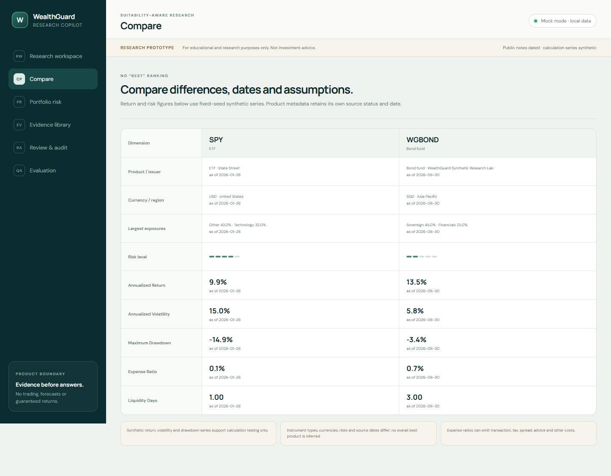
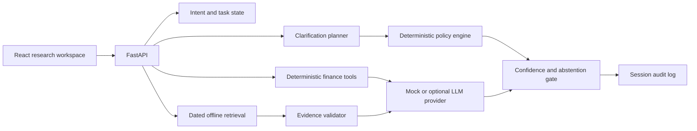

# WealthGuard Copilot

**Suitability-Aware Wealth & Securities Research Copilot**

> For educational and research purposes only. Not investment advice.

WealthGuard Copilot is a local-first product prototype for turning an ambiguous wealth or
securities question into a bounded, evidence-backed research task. It asks the missing question
most likely to change the safe research path, retrieves dated source notes, delegates financial
arithmetic to deterministic tools, and exposes the entire decision trace for review.

It is not a brokerage, robo-adviser, price predictor, product-ranking engine, regulated
suitability assessment, or live financial-institution product. It never places trades and does
not connect to a brokerage account.

## The product problem

Generic financial chatbots often answer before establishing a user's horizon, liquidity need,
loss tolerance, or intended task. They may blur education, product research, personalised advice,
and execution; perform important arithmetic in free-form text; or present undated claims without
an inspectable source trail.

WealthGuard changes that interaction:

```text
question -> intent -> missing context -> highest-value clarification
         -> policy boundary -> dated retrieval -> deterministic tools
         -> evidence validation -> confidence gate -> answer / caution / abstain / refuse
         -> audit trace
```

The distinction from a conventional financial Q&A demo is structural:

| Concern | WealthGuard control |
| --- | --- |
| Ambiguous request | Forward-simulates profile answers and prioritises clarification by information value |
| Advice/execution boundary | Deterministic policy engine outside the model |
| Financial arithmetic | Tested Python functions with formulas and assumptions |
| Unsupported claims | Citation identifiers are validated before response delivery |
| Stale information | Publication and retrieval dates are retained and surfaced |
| Model unavailable | Mock provider preserves the core demo without an API key |
| Reviewability | Append-only session trace records intent, policy, evidence, tools, model, and prompt version |

## Three-minute product tour

1. Ask **“Is SPY suitable for me?”** with an incomplete research profile.
2. Inspect why the system prioritises a horizon, liquidity, or loss-tolerance question.
3. Add the requested context and run the research trace again.
4. Review dated SEC/Investor.gov notes and synthetic calculation outputs.
5. Ask **“Buy 100 shares of AAPL for me”** and inspect the deterministic refusal.
6. Open **Review & audit** and **Evaluation** to inspect the trace and committed regression run.

See [the full demo script](docs/DEMO_SCRIPT.md).

## Product surfaces

- **Research workspace** — intent, task state, clarification candidates, policy decisions,
  evidence, calculations, confidence, and limitations.
- **Research profile** — voluntary context that can be edited, skipped, or reset.
- **Compare** — side-by-side differences without a single “best” ranking.
- **Portfolio risk** — concentration, sector/region/currency exposure, synthetic volatility and
  drawdown, and a simple synthetic scenario.
- **Evidence library** — source URL, document type, dates, provenance label, and checksum.
- **Review & audit** — request-to-response decision trace.
- **Evaluation** — reproducible metrics and failures from the committed synthetic suite.




## Architecture



The backend is authoritative for policy, arithmetic, citations, and audit records. The frontend
only renders structured results. Business logic never depends on a specific model name.

## Converge lineage

The repository was designed after a read-only inspection of Converge at commit
`b371720f5a02afc5791fdbd8887927d6452f923e`. It adapts the concepts of explicit user state,
forward simulation, expected information gain, intent override, confidence gates, audit traces,
and deterministic evaluation to a finance research setting.

No Converge source file, Git metadata, dataset, evaluation result, cache, key, or machine-specific
configuration was copied. Shopping-specific ranking, catalog, and hackathon components were not
reused. See [the migration record](docs/CONVERGE_MIGRATION.md).

## What AI, deterministic software, and the human each own

- **AI provider:** may turn already-selected evidence into concise language. Mock mode is the
  default, and provider output must pass a structured schema and citation validation.
- **Deterministic software:** owns intent guardrails, suitability-policy rules, clarification
  scoring, evidence dates, all numerical calculations, validation, confidence modes, and audit.
- **Human user/reviewer:** supplies or withdraws voluntary context, checks dated primary sources,
  decides whether the research is relevant, and owns every real-world financial decision.

## Data and provenance

The offline demo includes short, manually curated paraphrases of:

- a 26 January 2026 SPY prospectus filed on SEC EDGAR;
- Apple's fiscal-2025 Form 10-K filed on 31 October 2025;
- Investor.gov education pages on fund fees and diversification;
- two explicitly synthetic fund/disclosure fixtures.

All return, volatility, drawdown, allocation, exposure, and scenario series are deterministic
synthetic fixtures generated with seed `7319`. They are not historical performance. Every document
records `source_name`, `source_url`, `document_type`, `published_at`, `retrieved_at`,
`instrument_id`, `data_status`, and a SHA-256 checksum. See [data sources](docs/DATA_SOURCES.md)
and [the data dictionary](docs/DATA_DICTIONARY.md).

## Local setup

Requirements: Python 3.11+, Node.js 20+, and pnpm 10+.

```powershell
python -m venv .venv
.\.venv\Scripts\python.exe -m pip install -e ".[dev]"
pnpm --dir frontend install
```

Start the API in terminal 1:

```powershell
.\.venv\Scripts\python.exe -m uvicorn wealthguard.api:app --host 127.0.0.1 --port 8000
```

Start the UI in terminal 2:

```powershell
pnpm --dir frontend dev --host 127.0.0.1
```

Open `http://127.0.0.1:5173`. No API key is required.

Optional provider variables are documented in `.env.example`. The core policy, retrieval,
calculation, and evaluation paths do not require or trust an LLM.

## Verification

```powershell
.\.venv\Scripts\python.exe -m ruff format --check backend tests
.\.venv\Scripts\python.exe -m ruff check backend tests
.\.venv\Scripts\python.exe -m pytest
.\.venv\Scripts\python.exe -m wealthguard.evaluation.runner
pnpm --dir frontend typecheck
pnpm --dir frontend build
```

The latest committed evaluation artifact contains **126 fixed-seed synthetic taxonomy cases**.
The verified run passed 126/126. This is regression coverage, not an estimate of real-user
quality, regulatory compliance, investment performance, conversion, or production reliability.
Definitions, denominators, baselines, and limitations are in
[the evaluation report](docs/EVALUATION_REPORT.md).

## Documentation

- [Implementation plan](docs/IMPLEMENTATION_PLAN.md)
- [Product case study](docs/PRODUCT_CASE_STUDY.md)
- [Converge migration](docs/CONVERGE_MIGRATION.md)
- [AI boundaries](docs/AI_BOUNDARIES.md)
- [Suitability policy](docs/SUITABILITY_POLICY.md)
- [Data sources](docs/DATA_SOURCES.md)
- [Data dictionary](docs/DATA_DICTIONARY.md)
- [Calculation methods](docs/CALCULATION_METHODS.md)
- [Evaluation report](docs/EVALUATION_REPORT.md)
- [Demo script](docs/DEMO_SCRIPT.md)
- [Truth and limitations](docs/TRUTH_AND_LIMITATIONS.md)
- [Dependency licence review](docs/DEPENDENCY_LICENSES.md)

## Licence

Repository source is released under the MIT License. Public-source names and URLs remain subject
to their respective owners' terms. The project does not imply endorsement by any issuer,
regulator, exchange, financial institution, or technology company.
