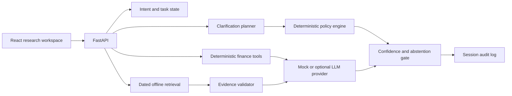

# WealthGuard Copilot

[**English**](README.md) · [简体中文](README.zh-CN.md)

**Before a financial answer becomes advice, WealthGuard turns it into a research trail you can inspect.**

> For educational and research purposes only. Not investment advice.

A person asks a simple question:

> **“Is SPY suitable for me?”**

It sounds answerable. But the useful research path may change completely depending on time horizon,
liquidity needs, loss tolerance, and what “suitable” is meant to mean. A fluent assistant can skip
those gaps, calculate inside prose, cite an undated page, and still sound certain.

WealthGuard takes a different path. It identifies the missing fact most likely to change the
research outcome and asks **one** question. It then retrieves dated, page-level official evidence,
runs financial arithmetic through deterministic tools, checks every citation, and shows the full
decision trace—including uncertainty, conflicts, and reasons to stop.

If the user asks it to place a trade, promise a return, or cross the boundary from research into
execution, it refuses. There is no brokerage connection and no hidden transaction path. The AI may
help explain selected evidence; deterministic software owns policy, calculations, validation, and
confidence gates. The human owns every real financial decision.

That is the product story:

```text
an ambiguous question
        ↓
the one missing fact that could change the path
        ↓
dated official evidence + reproducible calculations
        ↓
answer / caution / abstain / refuse
        ↓
an inspectable research trail
```

WealthGuard is a local React/FastAPI research prototype—not a brokerage, robo-adviser, price
predictor, regulated suitability assessment, or live financial-institution product. Profiles,
portfolios, market-series calculations, and evaluation sessions are synthetic. Its purpose is to
demonstrate how evidence, boundaries, and reviewability can be designed into a financial research
experience before confident language reaches a user.

## Why this problem matters

The dangerous moment is not an obviously absurd answer. It is a plausible answer produced before
the system knows enough.

Financial research questions routinely mix four different jobs:

- learning how an instrument works;
- comparing products using dated facts and explicit assumptions;
- interpreting a portfolio or personal constraint;
- asking for personalised advice or execution.

A generic chatbot can blur those jobs into one conversation. WealthGuard makes the boundary
visible. It does not maximise how often it answers; it tries to maximise how often the result is
appropriately framed, supported, reproducible, and honest about what remains unknown.

## What happens in one research session

1. **Understand the job.** Classify the request as education, research, comparison, portfolio
   analysis, personalised advice, or execution.
2. **Ask only what can change the path.** Forward-simulate possible answers and select the
   highest-information-value clarification instead of running a fixed questionnaire.
3. **Keep policy outside the model.** Deterministic rules decide whether the system may answer,
   caution, reframe, abstain, refuse, or require human review.
4. **Ground the response.** Retrieve dated SEC, HKEX, SZSE, or CSRC material and preserve the exact
   page or paragraph, version, freshness status, and checksum.
5. **Calculate in code.** Returns, volatility, drawdown, allocation, exposure, and scenarios run
   through tested functions with visible assumptions.
6. **Make the result reviewable.** Validate citation IDs, surface conflicts and limitations, and
   record the request-to-response trace.

| Failure mode | WealthGuard response |
| --- | --- |
| Missing horizon, liquidity, or loss tolerance | Ask the single question most likely to change the research path |
| Advice or trade-execution request | Apply a deterministic boundary; no transaction capability exists |
| Arithmetic hidden inside fluent prose | Use tested functions with formulas and assumptions |
| Unsupported or stale claim | Validate evidence lineage and show dates, versions, and exact passages |
| Model timeout or malformed output | Degrade to the deterministic path, caution, or abstention |
| Reviewer asks “why did it say this?” | Expose intent, policy, evidence, tools, confidence, and prompt version |

## See the story in 2:35

[Watch the narrated demo with Chinese captions](demo-video/wealthguard-demo-captioned.mp4) ·
[Clean narrated master](demo-video/wealthguard-demo-clean.mp4) ·
[Chinese SRT](demo-video/wealthguard-demo.zh-CN.srt)

The demo follows one question from ambiguity to evidence:

1. Ask **“Is SPY suitable for me?”** with an incomplete voluntary research profile.
2. See why horizon, liquidity, or loss tolerance could change the path—and why only one is asked.
3. Add the missing context and rerun the same research task.
4. Open the exact official passage behind a claim and inspect its location and checksum.
5. Ask **“Buy 100 shares of AAPL for me”** and see the deterministic refusal.
6. Open **Review & audit** to reconstruct the complete decision trail.
7. Open **Evaluation** to inspect the committed regression results and their limitations.

See [the full demo script](docs/DEMO_SCRIPT.md) and
[the reproducible video-production notes](docs/DEMO_VIDEO_PRODUCTION.md).

## What the prototype includes

- **Research workspace** — the question, clarification, policy state, evidence, calculations,
  confidence, and limitations in one trace.
- **Research profile** — voluntary context stored in the user's own browser; it can be edited,
  skipped, or reset.
- **Compare** — dated, side-by-side differences without manufacturing a single “best” product.
- **Portfolio risk** — concentration, sector/region/currency exposure, and explicitly synthetic
  volatility, drawdown, and scenarios.
- **Evidence library** — 13 cached official originals with versions, locations, and checksums.
- **Review & audit** — an append-only request-to-response trace.
- **Evaluation** — reproducible metrics and failures from the committed synthetic suite.
- **Mobile/PWA experience** — home-screen installation, persistent English / 简体中文 switching,
  and a browser-local 14-day dogfood log that can be exported for review.

Official titles and cited passages remain in their source language so the evidence is not silently
altered.


<p align="center">
  <a href="docs/media/mobile-dogfood-home-zh-1.png"></a>
  <a href="docs/media/mobile-dogfood-home-zh-2.png"></a>
  <a href="docs/media/mobile-dogfood-home-zh-3.png"></a>
</p>


## Architecture



The backend is authoritative for policy, arithmetic, citations, and audit records. The frontend
only renders structured results. Business logic never depends on a specific model name.

## Converge lineage

The repository was designed after a read-only inspection of Converge at commit
`b371720f5a02afc5791fdbd8887927d6452f923e`. It adapts the concepts of explicit user state,
forward simulation, expected information gain, intent override, confidence gates, audit traces,
and deterministic evaluation to a finance research setting.

No Converge source file, Git metadata, dataset, evaluation result, cache, key, or machine-specific
configuration was copied. Shopping-specific ranking, catalog, and hackathon components were not
reused. See [the migration record](docs/CONVERGE_MIGRATION.md).

## What AI, deterministic software, and the human each own

- **AI provider:** may turn already-selected evidence into concise language. Mock mode is the
  default, and provider output must pass a structured schema and citation validation.
- **Deterministic software:** owns intent guardrails, suitability-policy rules, clarification
  scoring, evidence dates, all numerical calculations, validation, confidence modes, and audit.
- **Human user/reviewer:** supplies or withdraws voluntary context, checks dated primary sources,
  decides whether the research is relevant, and owns every real-world financial decision.

## Data and provenance

The offline pack contains 13 real public documents from SEC, HKEX, SZSE and CSRC official domains:
three annual reports, three fund/ETF prospectuses, four investor-education documents, two
regulatory rules and one exchange notice. Original PDF/HTML is retained and parsed into 1,714
checksum-bound chunks with PDF pages or HTML paragraph/source-line locations. Claims open an
escaped exact-passage viewer and, for PDFs, the cached original page.

All return, volatility, drawdown, allocation, exposure, and scenario series are deterministic
synthetic fixtures generated with seed `7319`. They are not historical performance. Every document
records `source_name`, `source_url`, `document_type`, `published_at`, `retrieved_at`, version,
`instrument_id`, location, `data_status`, and SHA-256 checksums. See [data sources](docs/DATA_SOURCES.md)
and [the data dictionary](docs/DATA_DICTIONARY.md).

## Local setup

Requirements: Python 3.11+, Node.js 20+, and pnpm 10+.

```powershell
python -m venv .venv
.\.venv\Scripts\python.exe -m pip install -e ".[dev]"
pnpm --dir frontend install
```

Start the API in terminal 1:

```powershell
.\.venv\Scripts\python.exe -m uvicorn wealthguard.api:app --host 127.0.0.1 --port 8000
```

Start the UI in terminal 2:

```powershell
pnpm --dir frontend dev --host 127.0.0.1
```

Open `http://127.0.0.1:5173`. No API key is required.

For a production-equivalent single-container run, build the web app and serve it from FastAPI:

```powershell
pnpm --dir frontend build
.\.venv\Scripts\python.exe -m uvicorn wealthguard.api:app --host 0.0.0.0 --port 8000
```

Or build the included container:

```powershell
docker build -t wealthguard-copilot .
docker run --rm -p 8000:8000 wealthguard-copilot
```

Optional provider variables are documented in `.env.example`. The core policy, retrieval,
calculation, and evaluation paths do not require or trust an LLM.

The committed offline pack runs without network access. To deliberately refresh it from the
allowlisted official URLs, then rebuild all extracted chunks:

```powershell
.\.venv\Scripts\python.exe scripts\download_official_sources.py --force
.\.venv\Scripts\python.exe scripts\build_official_corpus.py
```

Review the changed files, versions and checksums before committing a refresh.

## Verification

```powershell
.\.venv\Scripts\python.exe -m ruff format --check backend tests scripts
.\.venv\Scripts\python.exe -m ruff check backend tests scripts
.\.venv\Scripts\python.exe -m pytest
.\.venv\Scripts\python.exe -m wealthguard.evaluation.runner
.\.venv\Scripts\python.exe scripts\run_citation_evaluation.py
pnpm --dir frontend typecheck
pnpm --dir frontend build
```

The latest artifacts contain **126 fixed-seed synthetic taxonomy cases** (126/126) and **39
official citation-trace cases** (39/39; three spans per source). This is regression and integrity
coverage, not an estimate of real-user
quality, regulatory compliance, investment performance, conversion, or production reliability.
Definitions, denominators, baselines, and limitations are in
[the evaluation report](docs/EVALUATION_REPORT.md).

## Documentation

- [Implementation plan](docs/IMPLEMENTATION_PLAN.md)
- [Product case study](docs/PRODUCT_CASE_STUDY.md)
- [Converge migration](docs/CONVERGE_MIGRATION.md)
- [AI boundaries](docs/AI_BOUNDARIES.md)
- [Suitability policy](docs/SUITABILITY_POLICY.md)
- [Data sources](docs/DATA_SOURCES.md)
- [Data dictionary](docs/DATA_DICTIONARY.md)
- [Calculation methods](docs/CALCULATION_METHODS.md)
- [Evaluation report](docs/EVALUATION_REPORT.md)
- [Demo script](docs/DEMO_SCRIPT.md)
- [Truth and limitations](docs/TRUTH_AND_LIMITATIONS.md)
- [Dependency licence review](docs/DEPENDENCY_LICENSES.md)
- [Final delivery audit](docs/FINAL_AUDIT.md)
- [Public deployment](docs/PUBLIC_DEPLOYMENT.md)
- [Two-week real-use validation](docs/TWO_WEEK_DOGFOOD_PLAN.md)

## Licence

Repository source is released under the MIT License. Public-source names and URLs remain subject
to their respective owners' terms. The project does not imply endorsement by any issuer,
regulator, exchange, financial institution, or technology company.
