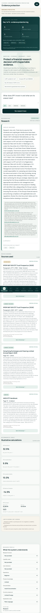
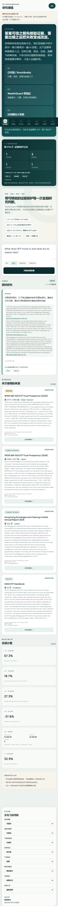
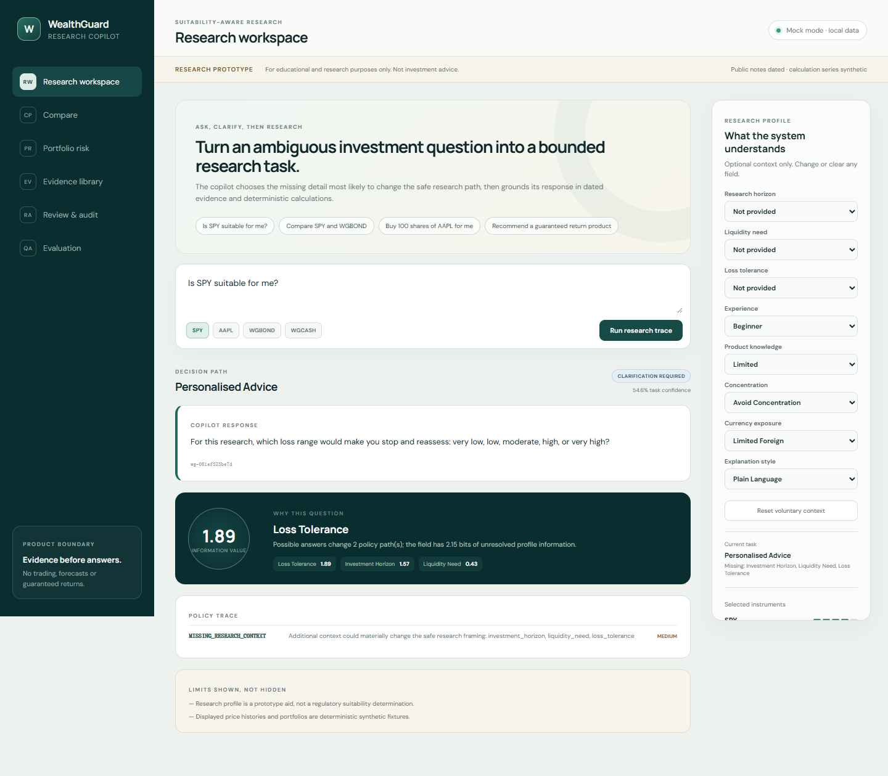
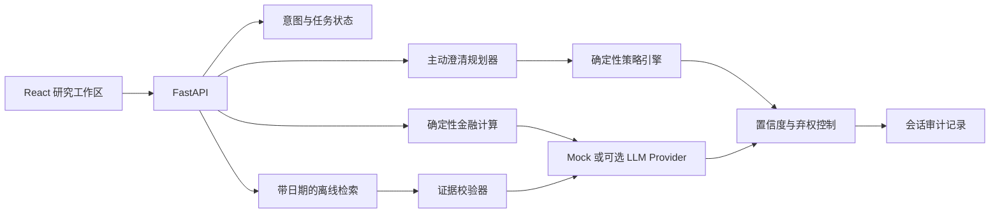

# WealthGuard Copilot

[English](README.md) · [**简体中文**](README.zh-CN.md)

**具备适当性约束的财富与证券证据化研究保护系统**

> 仅用于教育与研究，不构成投资建议。

WealthGuard 不是普通金融聊天机器人或 AI 投顾，而是一层位于“用户问题”和“研究结论”之间的保护系统。它把模糊的理财或证券问题转化为边界清晰、证据可追溯的研究任务：优先提出最可能改变研究路径的澄清问题，检索带日期和具体位置的官方材料，用确定性程序完成金融计算，并把策略判断、证据和限制完整展示给用户复核。

它不是券商、自动投顾、价格预测器、产品排名工具或法律意义上的适当性评估系统；不会提供明确买入、卖出、持有或仓位建议，不执行交易，也不连接真实券商账户。

桌面端与移动端均支持记住偏好的**英文 / 简体中文一键切换**。产品控件、状态和系统解释会随语言切换；官方文件标题与引用片段保留来源语言，避免在翻译过程中悄然改变证据含义。

## 为什么做这个产品

普通金融问答产品经常在不了解用户期限、流动性需求、亏损容忍度和任务目的之前直接作答，也容易混淆金融教育、资料研究、个性化建议和交易执行。

WealthGuard 将流程改造成：

```text
问题 → 意图判断 → 缺失信息 → 高信息价值澄清
     → 适当性与策略边界 → 带日期的资料检索 → 确定性计算
     → 证据校验 → 置信度门控 → 回答 / 提醒 / 弃权 / 拒答
     → 完整审计记录
```

| 常见风险 | WealthGuard 的产品控制 |
| --- | --- |
| 用户意图不完整 | 模拟不同回答对结果的影响，优先询问信息价值最高的问题 |
| 研究与投资建议混淆 | 使用独立于模型的确定性策略引擎划定边界 |
| 模型直接生成关键数字 | 由经过测试的 Python 工具完成计算并公开公式与假设 |
| 结论缺乏依据 | 验证引用片段、父文档与 SHA-256 checksum |
| 使用陈旧或冲突资料 | 展示发布时间、获取时间、版本状态和数字冲突 |
| 模型或 API 不可用 | 默认 Mock Provider，无密钥也能运行核心产品与评测 |
| 无法复盘 AI 决策 | 记录意图、澄清、策略、证据、工具、模型和 Prompt 版本 |

## 三分钟演示路径

[观看 2 分 35 秒中文旁白字幕版](demo-video/wealthguard-demo-captioned.mp4) ·
[无内嵌字幕旁白母版](demo-video/wealthguard-demo-clean.mp4) ·
[中文字幕文件](demo-video/wealthguard-demo.zh-CN.srt)

1. 在研究信息不完整时询问：**“Is SPY suitable for me?”**。
2. 查看系统为何优先询问期限、流动性需求或亏损容忍度。
3. 补充信息后重新运行研究流程。
4. 打开结论对应的 SEC、港交所、深交所或证监会原文位置，核对页码、段落、日期和 checksum。
5. 输入：**“Buy 100 shares of AAPL for me”**，查看系统如何通过确定性策略拒绝交易执行。
6. 在 **Review & audit** 和 **Evaluation** 中检查完整决策轨迹与真实回归结果。

完整脚本见 [演示说明](docs/DEMO_SCRIPT.md)，制作与复现流程见
[演示视频制作说明](docs/DEMO_VIDEO_PRODUCTION.md)。

## 产品界面

- **Evidence protection**：呈现意图、任务状态、主动澄清、策略、证据、计算、置信度和限制。
- **Research profile**：用户可自愿提供、修改、跳过或撤回研究背景信息。
- **Compare**：并列呈现差异和不可比因素，不给出简单的“最好”排名。
- **Portfolio risk**：使用合成组合展示集中度、行业、地区、币种、波动、回撤和压力情景。
- **Evidence library**：保存 13 份官方原始文件的版本、位置和 checksum。
- **Review & audit**：回放从问题到回答的完整决策过程。
- **Evaluation**：展示固定测试集、基线、指标和失败案例。







## 系统架构



后端对策略判断、金融计算、引用和审计负责；前端只渲染结构化结果。核心业务逻辑不依赖某一个模型名称。

## AI、程序与人的责任边界

- **AI Provider**：把已经选定和校验的证据组织成简洁语言；结构化输出失败时安全降级。
- **确定性程序**：负责意图护栏、适当性规则、澄清排序、证据时间、金融计算、校验和置信度控制。
- **用户与审核者**：决定是否提供或撤回背景信息，检查官方原文，并对所有现实金融决策负责。

## 数据与证据来源

离线样本包包含来自 SEC、港交所、深交所和证监会官方域名的 **13 份真实公开文件**，包括年报、基金或 ETF 说明书、投资者教育材料、监管规则和交易所公告。PDF 与 HTML 被解析为 **1,714 个**绑定 checksum 的片段，并保留 PDF 页码或 HTML 段落与源码行位置。

收益率、波动率、回撤、组合和压力情景使用随机种子 `7319` 生成的确定性合成数据，不是真实历史业绩。数据口径见 [数据来源](docs/DATA_SOURCES.md)和[数据字典](docs/DATA_DICTIONARY.md)。

## 本地运行

环境要求：Python 3.11+、Node.js 20+、pnpm 10+。

```powershell
python -m venv .venv
.\.venv\Scripts\python.exe -m pip install -e ".[dev]"
pnpm --dir frontend install
```

终端一：

```powershell
.\.venv\Scripts\python.exe -m uvicorn wealthguard.api:app --host 127.0.0.1 --port 8000
```

终端二：

```powershell
pnpm --dir frontend dev --host 127.0.0.1
```

打开 `http://127.0.0.1:5173`。核心 Demo 不需要 API Key。

也可以使用单容器运行：

```powershell
docker build -t wealthguard-copilot .
docker run --rm -p 8000:8000 wealthguard-copilot
```

## 验证结果

```powershell
.\scripts\verify.ps1
```

当前提交中的实际输出包括：

- Python 自动化测试：**70/70 通过**。
- 固定种子产品与策略回归：**126/126 通过**。
- 官方引用追溯测试：**39/39 通过**，覆盖 13 份官方文件。
- 390×844 移动端自动检查：无横向溢出；研究记录、原文打开和反馈可在浏览器中持久化。

这些结果只代表当前固定测试集的回归与完整性覆盖，不代表真实用户质量、监管合规、投资业绩、转化率或生产可靠性。指标定义与局限见[评测报告](docs/EVALUATION_REPORT.md)。

## 文档导航

- [产品案例](docs/PRODUCT_CASE_STUDY.md)
- [实现方案](docs/IMPLEMENTATION_PLAN.md)
- [AI 能力边界](docs/AI_BOUNDARIES.md)
- [适当性策略](docs/SUITABILITY_POLICY.md)
- [数据来源](docs/DATA_SOURCES.md)
- [金融计算方法](docs/CALCULATION_METHODS.md)
- [评测报告](docs/EVALUATION_REPORT.md)
- [真实性与局限](docs/TRUTH_AND_LIMITATIONS.md)
- [Converge 能力迁移记录](docs/CONVERGE_MIGRATION.md)
- [两周真实使用方案](docs/TWO_WEEK_DOGFOOD_PLAN.md)

## 许可与声明

项目源代码使用 MIT License。公开资料的名称、链接和原始内容仍受各自权利人条款约束。本项目不暗示获得任何发行人、交易所、监管机构、券商、腾讯、微信或其他机构的认可或合作。
