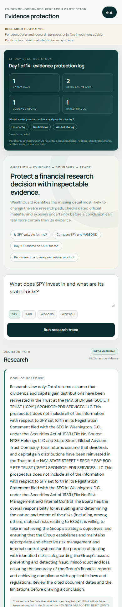
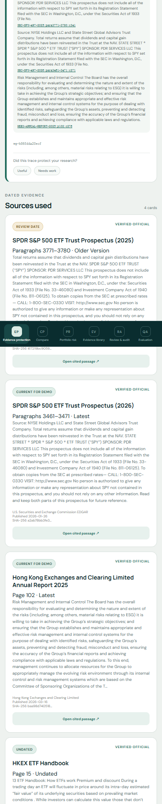
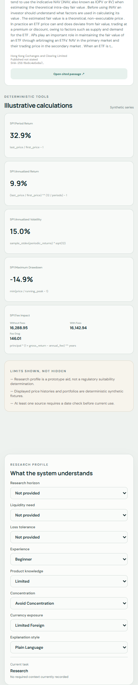
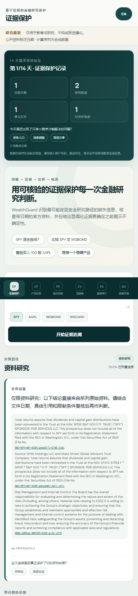
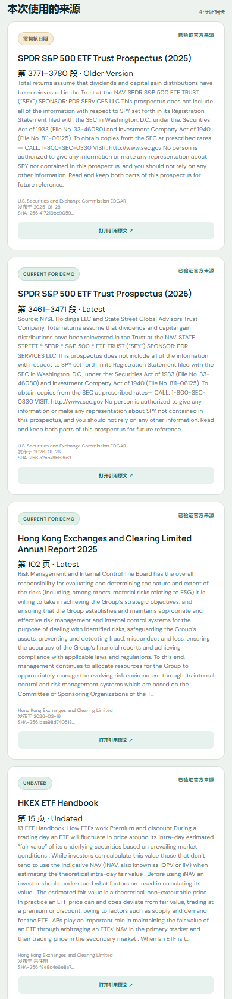
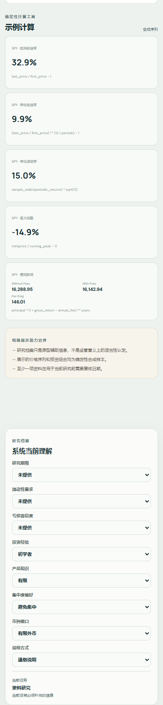
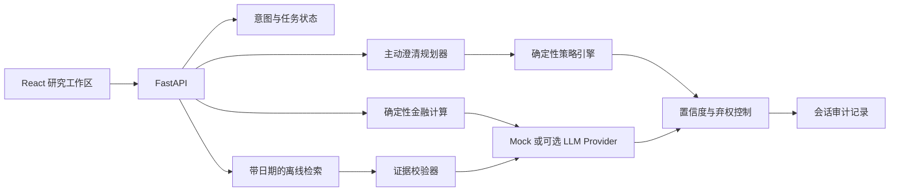

# WealthGuard Copilot

[English](README.md) · [**简体中文**](README.zh-CN.md)

**在一个金融回答变成投资建议之前，WealthGuard 先把它变成一条可以核查的研究轨迹。**

> 仅用于教育与研究，不构成投资建议。

一个人提出了一个看似简单的问题：

> **“SPY 适合我吗？”**

这个问题听起来应该马上就能回答。但研究路径可能因为投资期限、流动性需求、亏损承受
能力，以及用户所说的“适合”究竟指什么而完全改变。一个表达流畅的 AI 可以跳过这些
缺口，在自然语言里心算关键数字，引用一份没有日期的材料，然后仍然显得十分确定。

WealthGuard 不急着给结论。它先找出**最可能改变研究路径的那一项缺失信息**，只问一个
问题；随后检索带日期和具体页码的官方材料，让确定性程序完成金融计算，逐条校验引用，
最后把完整决策轨迹交给用户检查——包括不确定性、资料冲突，以及系统为什么应该停下来。

如果用户要求它代为交易、保证收益，或者把研究越界成执行，它会拒绝。系统没有连接券商，
也不存在隐藏的下单路径。AI 可以帮助解释已经选定的证据；确定性程序负责策略、计算、
校验和置信度边界；所有现实金融决策始终由人负责。

这就是 WealthGuard 的故事：

```text
一个信息不完整的问题
        ↓
找出真正可能改变路径的缺失信息
        ↓
带日期的官方证据 + 可复现的计算
        ↓
回答 / 提醒 / 弃权 / 拒绝
        ↓
一条可以独立复核的研究轨迹
```

WealthGuard 是一个本地运行的 React/FastAPI 研究原型，不是券商、自动投顾、价格预测器、
产品排名工具、法律意义上的适当性评估系统或真实金融机构产品。项目中的研究档案、组合、
市场序列计算和评测会话均为合成数据。它要验证的不是“AI 能否说得像专家”，而是：
**在一段自信的金融语言抵达用户之前，能否把证据、边界与可复核性设计进产品。**

## 为什么这个问题值得解决

真正危险的通常不是一个荒谬答案，而是一个在信息不足时生成、听起来又完全合理的答案。

用户的一句话里，可能混合了四种不同任务：

- 学习一种金融工具如何运作；
- 根据带日期的事实和明确假设比较产品；
- 理解个人约束或投资组合风险；
- 寻求个性化建议或要求执行交易。

普通聊天机器人很容易把它们揉成一次连续对话。WealthGuard 将边界明确展示出来。它追求的
不是“尽可能多回答”，而是让每个结果都有恰当的任务边界、可检查的证据、可复现的计算，
并诚实说明仍然不知道什么。

## 一次研究会话是怎样完成的

1. **先判断用户真正要完成的任务。** 将请求区分为金融教育、资料研究、产品比较、
   组合分析、个性化建议或交易执行。
2. **只问可能改变路径的问题。** 模拟不同回答会怎样影响后续策略，从而选择信息价值
   最高的一项澄清，而不是让用户填写一套固定问卷。
3. **让策略边界独立于模型。** 由确定性规则决定系统应该回答、提醒、重新界定问题、
   弃权、拒绝，还是交由人工复核。
4. **让每个结论落到原始证据。** 检索 SEC、港交所、深交所或证监会材料，并保留准确的
   页码或段落、版本、时效状态与 checksum。
5. **让重要数字在代码中计算。** 收益率、波动率、回撤、配置、敞口和情景分析由经过
   测试的函数完成，同时展示公式与假设。
6. **让整个过程能够被复盘。** 校验引用 ID，展示资料冲突与局限，并记录从请求到回答的
   完整轨迹。

| 容易发生的问题 | WealthGuard 如何处理 |
| --- | --- |
| 缺少期限、流动性或亏损承受能力 | 只问最可能改变研究路径的那一个问题 |
| 把资料研究变成建议或交易执行 | 使用确定性边界；系统本身没有交易能力 |
| 关键数字藏在流畅的自然语言中 | 使用经过测试的函数，并展示公式与假设 |
| 结论缺少依据或引用已过时 | 校验证据链，并展示日期、版本和准确原文 |
| 模型超时或返回格式错误 | 降级到确定性路径、风险提醒或弃权 |
| 审核者追问“为什么这样回答” | 展示意图、策略、证据、工具、置信度和 Prompt 版本 |

## 三分钟演示路径

[观看 2 分 35 秒中文旁白字幕版](demo-video/wealthguard-demo-captioned.mp4) ·
[无内嵌字幕旁白母版](demo-video/wealthguard-demo-clean.mp4) ·
[中文字幕文件](demo-video/wealthguard-demo.zh-CN.srt)

1. 在研究信息不完整时询问：**“Is SPY suitable for me?”**。
2. 查看系统为何优先询问期限、流动性需求或亏损容忍度。
3. 补充信息后重新运行研究流程。
4. 打开结论对应的 SEC、港交所、深交所或证监会原文位置，核对页码、段落、日期和 checksum。
5. 输入：**“Buy 100 shares of AAPL for me”**，查看系统如何通过确定性策略拒绝交易执行。
6. 在 **Review & audit** 和 **Evaluation** 中检查完整决策轨迹与真实回归结果。

完整脚本见 [演示说明](docs/DEMO_SCRIPT.md)，制作与复现流程见
[演示视频制作说明](docs/DEMO_VIDEO_PRODUCTION.md)。

## 产品界面

- **Evidence protection**：呈现意图、任务状态、主动澄清、策略、证据、计算、置信度和限制。
- **Research profile**：用户可自愿提供、修改、跳过或撤回研究背景信息。
- **Compare**：并列呈现差异和不可比因素，不给出简单的“最好”排名。
- **Portfolio risk**：使用合成组合展示集中度、行业、地区、币种、波动、回撤和压力情景。
- **Evidence library**：保存 13 份官方原始文件的版本、位置和 checksum。
- **Review & audit**：回放从问题到回答的完整决策过程。
- **Evaluation**：展示固定测试集、基线、指标和失败案例。

**英文移动端**

<p align="center">
  <a href="docs/media/mobile-dogfood-home-1.png"></a>
  <a href="docs/media/mobile-dogfood-home-2.png"></a>
  <a href="docs/media/mobile-dogfood-home-3.png"></a>
</p>

**中文移动端（一键切换后）**

<p align="center">
  <a href="docs/media/mobile-dogfood-home-zh-1.png"></a>
  <a href="docs/media/mobile-dogfood-home-zh-2.png"></a>
  <a href="docs/media/mobile-dogfood-home-zh-3.png"></a>
</p>


## 系统架构



后端对策略判断、金融计算、引用和审计负责；前端只渲染结构化结果。核心业务逻辑不依赖某一个模型名称。

## AI、程序与人的责任边界

- **AI Provider**：把已经选定和校验的证据组织成简洁语言；结构化输出失败时安全降级。
- **确定性程序**：负责意图护栏、适当性规则、澄清排序、证据时间、金融计算、校验和置信度控制。
- **用户与审核者**：决定是否提供或撤回背景信息，检查官方原文，并对所有现实金融决策负责。

## 数据与证据来源

离线样本包包含来自 SEC、港交所、深交所和证监会官方域名的 **13 份真实公开文件**，包括年报、基金或 ETF 说明书、投资者教育材料、监管规则和交易所公告。PDF 与 HTML 被解析为 **1,714 个**绑定 checksum 的片段，并保留 PDF 页码或 HTML 段落与源码行位置。

收益率、波动率、回撤、组合和压力情景使用随机种子 `7319` 生成的确定性合成数据，不是真实历史业绩。数据口径见 [数据来源](docs/DATA_SOURCES.md)和[数据字典](docs/DATA_DICTIONARY.md)。

## 本地运行

环境要求：Python 3.11+、Node.js 20+、pnpm 10+。

```powershell
python -m venv .venv
.\.venv\Scripts\python.exe -m pip install -e ".[dev]"
pnpm --dir frontend install
```

终端一：

```powershell
.\.venv\Scripts\python.exe -m uvicorn wealthguard.api:app --host 127.0.0.1 --port 8000
```

终端二：

```powershell
pnpm --dir frontend dev --host 127.0.0.1
```

打开 `http://127.0.0.1:5173`。核心 Demo 不需要 API Key。

也可以使用单容器运行：

```powershell
docker build -t wealthguard-copilot .
docker run --rm -p 8000:8000 wealthguard-copilot
```

## 验证结果

```powershell
.\scripts\verify.ps1
```

当前提交中的实际输出包括：

- Python 自动化测试：**70/70 通过**。
- 固定种子产品与策略回归：**126/126 通过**。
- 官方引用追溯测试：**39/39 通过**，覆盖 13 份官方文件。
- 390×844 移动端自动检查：无横向溢出；研究记录、原文打开和反馈可在浏览器中持久化。

这些结果只代表当前固定测试集的回归与完整性覆盖，不代表真实用户质量、监管合规、投资业绩、转化率或生产可靠性。指标定义与局限见[评测报告](docs/EVALUATION_REPORT.md)。

## 文档导航

- [产品案例](docs/PRODUCT_CASE_STUDY.md)
- [实现方案](docs/IMPLEMENTATION_PLAN.md)
- [AI 能力边界](docs/AI_BOUNDARIES.md)
- [适当性策略](docs/SUITABILITY_POLICY.md)
- [数据来源](docs/DATA_SOURCES.md)
- [金融计算方法](docs/CALCULATION_METHODS.md)
- [评测报告](docs/EVALUATION_REPORT.md)
- [真实性与局限](docs/TRUTH_AND_LIMITATIONS.md)
- [Converge 能力迁移记录](docs/CONVERGE_MIGRATION.md)
- [两周真实使用方案](docs/TWO_WEEK_DOGFOOD_PLAN.md)

## 许可与声明

项目源代码使用 MIT License。公开资料的名称、链接和原始内容仍受各自权利人条款约束。本项目不暗示获得任何发行人、交易所、监管机构、券商、腾讯、微信或其他机构的认可或合作。
